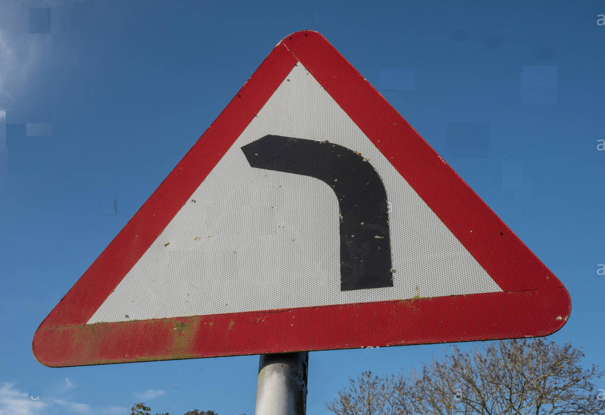
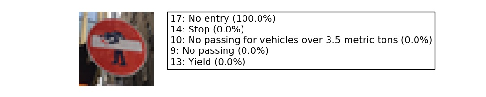
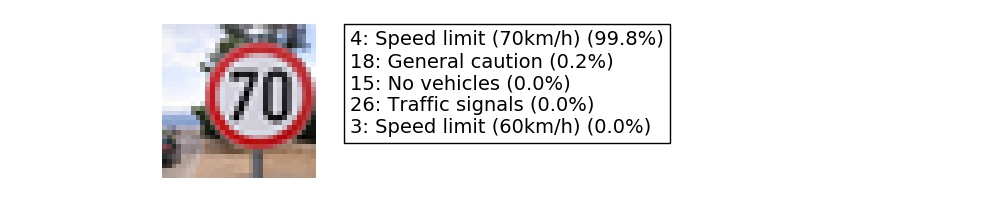

## Writeup for Traffic Sign Recognition Project
   
This file provides a description of the project goals and how I fulfil them. The sections of this document are structured following the project's  [Rubric](https://review.udacity.com/#!/rubrics/481/view).

Here is a link to my project code in a [Jupyter Notebook](./Traffic_Sign_Classifier.ipynb), and a [HTML version](./Traffic_Sign_Classifier.html).

### Dataset Exploration
#### 1. Dataset Summary

Once loaded, the training, validation, and test data are stored in numpy arrays. Using the shape property of numpy arrays I get the following summary statistics of the traffic
signs data set:

* The size of training set is 139196 (34799 x 4)
* The size of the validation set is 4410
* The size of test set is 12630
* The shape of a traffic sign image is (32, 32, 3)
* The number of unique classes/labels in the data set is 43

#### 2. Exploratory Visualization

Here is an exploratory visualization of the data set. On the raw images we observe a variety of illumination conditions, angles, and locations of the sign within the picture. The sign, however, consistently occupy a big area within the picture.

It is interesting to observe how the classes are not homogeneously distributed among the training data. Validation and Testing data present a similar distribution, as shown in the Jupyter Notebook. This can relevant for the accuracy of classes that appear less frequently on the training data.

#### 3. Data augmentation

Data augmentation improves the training of the neural network by artificially adding new data through smal transformations of the original data. Our train data was augmented using the routines contained in `data_augmentation.py`. There are three simple image transformations:

* Translation: the image is moved randomly up to 20% of the image size
* Rotation: the image is rotated randomly up to 25 degrees
* Rectangles: A random black rectangle will cover a portion of the image

Each of the transformed train sets is saved into its pickle file. This makes possible to add different sets (or all) and explore what effect each of them has on improving accuracy. 

Adding these transformed train sets did not improve much the validation accuracy (once the architecture and hyperparameters were optimized). However it improved dramatically the detection of the traffic sign pictures I collected from Internet.

I conclude that training and validation sets had some common properties, maybe coming from the same source, and the model adapted to these common features. Thus it was not doing so good on images with higher variability, randomly collected. That could be corrected introducing higher variability on the training set.

### Design and Test a Model Architecture
#### 1. Preprocessing
I decided against converting to grayscale, because a first check did not show an improve accuray. That makes sense to me, because as humans we rely on the info color gives us to recognize traffic signs. They are actually designed with simple color schemes to ease recognition. Thus I would think the color information is also useful to the neural net.

My preprocessing step is limited to zero centering and normalization.

#### 2. Model Architecture

My final model consisted of the following layers:

| Layer         		|     Description	        			| 
|:---------------------:|:---------------------------------------------:| 
| Input         		| 32x32x3 RGB image   			| 
| Convolution 5x5     	| 1x1 stride, valid padding, outputs 28x28x32 |
| RELU			|								|
| Batch normalization|								|
| Max pooling	      	| 2x2 stride,  outputs 14x14x32 			|
| Convolution 5x5	| 1x1 stride, valid padding, outputs 10x10x64 |
| RELU			|								|
| Max pooling	      	| 2x2 stride,  outputs 5x5x64 			|
| Flatten			| output dimension: 1600				|
| Fully connected	| output dimension: 1024				|
| Fully connected	| output dimension: 344				|
| Dropout			| keep_prob: 0.5					|
| Fully connected	| output dimension: 43				|

 
#### 3. Model Training

The model training uses Adam optimization algorithm. After 5 epochs the results were already above 93% on the validation set, and variation minimal between the lasts epochs. For the final training I let it run for 10 epochs, achieving 96% accuracy on the validation set.

The highest learning rate I could manually set without leading to loss divergence was around 5e-3. I set then the rate to 1e-3 and applied learning rate decay of 0.9 after each epoch. This resulted in a slight improvement on the final accuracy, and a much less noisy loss evolution on the final epochs could be clearly appreciated.

I found a batch size of 256 provided good training and was still not much time consuming.

#### 4. Solution Approach

The model described above is a modification of the LeNet5 architecture used in the classroom at the end of the CNN lesson. The convolution layers in this architecture are well adapted for image classification (it was developed for digits recognition on the MNIST database) and is thus a good starting point for traffic sign calssification.

My first implementation just changed the input dimention to 3 channels and output logits to 43 labels. It did not manage to train at all, although it still worked properly on MNIST. After debbuging I realized that my model would only begin to train after changing the weights declaration from `tf.Varible(...)` to `tf.get_variable(...)`. The difference should reside in the normal initialization of weights, that would not be appropriate on the German Sign Dataset, with color images. However, I don't fully understand why that is so, as this investigation proved much time consuming.

Afterward the following additions to the model were applied consecutively. Each of them helped to push the final accuracy basic percentage points upwards:

* Parameter increase on convolution layers (conv1: 6 to 32, conv2: 16 to 64)
* Parameter increase on fully connected layers (fc1: 400 to 1024, fc2: 84 to 344)
* Dropout
* Batch normalization

The bigger parameter numberss for convolutions and fully connected layers lead quickly to overfitting. The training accuracy shot up to 100% while the validation lagged below 90%. The dropout layer significantly reduced the overfitting problem, and was actually relevant with high number of parameters.

My final model results were:

* training set accuracy of ?
* validation set accuracy of ? 
* test set accuracy of ?

  

### Test a Model on New Images

#### 1. Acquiring New Images

I researched German traffic signs images on the web. I also took some pictures of traffic signs in my neighbourhood which, living in Germany myself, were well fitting for this project.

The pictures I took, as well as some found on the web were classiffied correctly and, once the model was trained with over 93% accuracy, represented no challenge. 

I include more challenging images as they are useful to test the limits of our model, such as:

- A defaced "Stop" sign
- A "Dangerous curve to the left" that is probably not a German sign (German signs on the dataset show a curve with smaller angle). Also it is relevant to remember that its class is one with the lower frequency in our training data histogram shown above. Thus the issue may be also related to lack of training examples.
- Incorrect cropping. Some signs were inside broader pictures, and I manually cropped the sign. If this cropping is not well focused on the sign, classification is difficult.
- [Edinburgh's road signs hacked by artist](https://www.bbc.com/news/uk-scotland-edinburgh-east-fife-46139025)

     

#### 2. Performance on New Images 

Here are the results of the prediction:

As mentioned above, I was very happy to find 100% accuracy in the pictures I took on my neighbourhood and some from the web. However I decided to focus on the more challenging cases for this project. Here the accuracy was 60%.

The main factor for improving this accuracy was the data augmentation process. As mentioned before, data augmentation did not improve the validation accuracy (it was already around 95%). However, without this step, only the"Yield" sign picture I took with my camera was recognized. That difference surprised me, and I decided to explore what effect each of my new dataset had:

| Data augmentation				|  Accuracy	| 
|:------------------------------------------:|:-----------------:| 
| None         					| 20% 		| 
| Translation					| 40%		|
| Rotation						| 40%		|
| Rectangles					| 40%		|
| Translation + Rotation + Rectangles| 60%		|

Which shows each of the transformations contribute to improve the accuracy, and adding the resulting data just adds to the final improvement. Of course, as the transformations were made with randomized parameters, these results could vary on succesive runs.

#### 3. Model Certainty - Softmax Probabilities

We can evaluate the softmax probabilities assigned to each class with the function `tf.nn.top_k`, as explained in the Jupyter Notebook . Looking at the top 5 classes on each picture gives us an insight to how certain the model is of its predictions.

On the **first picture**, despite the artistic addition, the correct class is given with 100% probability.

The **second picture** was taken with my camera and, despite what I thought were challenging illumination conditions, it detected the right class with 100% probability.

The **third picture** is interesting because, although to the human eye it is very easy to recognize, the model fails completely. It shows how sometimes what we consider small variations (a little bigger angle in the central line) can counterintuitively confuse the model. 

The **fourth picture** is also almost perfectly recognized after the data augmentation.

The **fifth picture** fails Interestingly we can see the model considers similar speed limits signs as second, fourth, and fifth options. In another cropping from the original picture where the sign was bigger and better centered the class was recognized by the model. In a real world application my manual cropping would be implemented by a detection algorithm. I decided to show this example to highlight how critical the detection algorithm would be.

#### 4. Further exploration in data augmentation

As I was fascinated by the effect of data augmentation of randomly selected pictures from the web, I decided to implement two other transformations and further augment my training data: Perpective change and adding white colored rectangles, using again the OpenCV library in the file `data_augmentation2.py`.

The addition of white rectangles had a dissapointing result. Accuracy was actually down, as the stop sign was no longer recognized. I could not make further experiments (different colors?) to check why this was so, because with bigger datasets my training time was getting too long, and even running out of memory in my computer.

The perspective change however was very succesful. Accuracy grows to 80% as the "Speed limit (70km/h)" was correctly detected. Unfortunately the dangerous curve to the left is still misclassified. The model is now even totally sure on its wrong prediction. This is especially dissapointing as I thought the orientation was the main cause of error in this picture, and this inspired me to implement the perspective change.
 
The new probabities are in general much better as shown below:

### Visualizing the Neural Network 

As suggested in the notebook, the convolution layers can be visualized by the piece of code provided. I only needed to pass the convoluution layer as output from the model function, in order for the variable to be accesed by the code. 

While the second convolution layer losses an easy geometrical interpretation, the first convolution layer visualizations highlight clearly the features of the sign. I chose to plot the only missclasified sign.

The different filters highlight different features of the image, as can be seen below. Some have an easy interpretation. For example, FeatureMap2 highlights the horizontal lines while FeatureMap highlights the vertical lines. FeatureMaps 8 and 12 seem to respond to the diagonal lines that would form the triangle of a warning sign. FeatureMap17 probably activates with the red colour. Unfortunately it is still not fully clear to me, from these maps, why this picture is misclassified as a warning for traffic lights. Some hypotheses can be made, though. For example the combinations of feature maps 26, 27, and 31 may be interpreted as the three colours location of a traffic lights warning sign. A comparison with the feature maps of a real traffic lights warning sign could be very informative to further debug in this direction.

